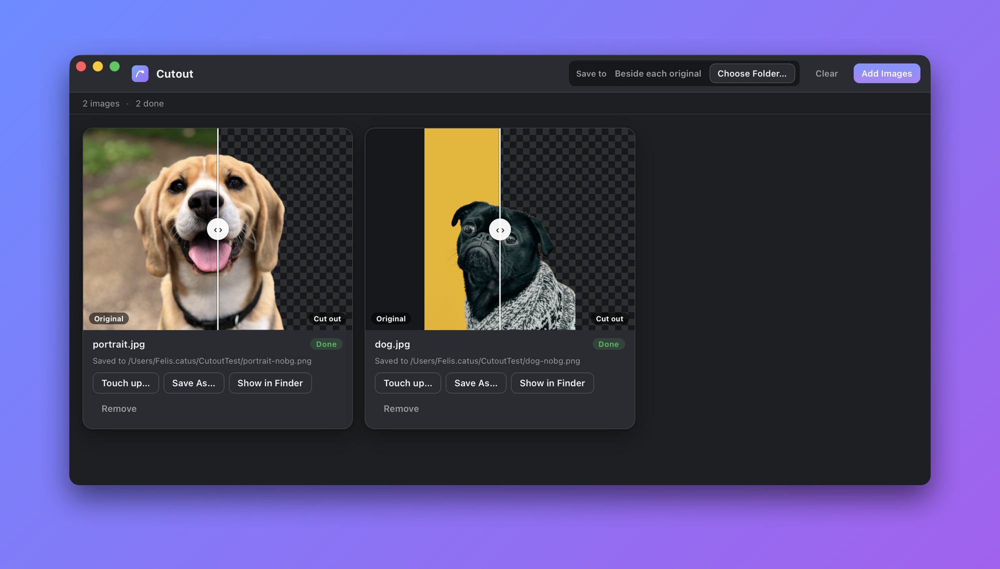

# Cutout

**Drag-and-drop background removal for macOS, powered by Apple's Vision framework — fully on-device, no uploads.**



## Download

### [⬇︎ Download for macOS](https://github.com/Alyetama/Cutout/releases/latest/download/Cutout.dmg)

Open the downloaded `Cutout.dmg` and drag **Cutout** into your Applications folder.
See [First launch](#first-launch) below — the app isn't signed with an Apple Developer ID, so macOS needs one extra step the first time.

Requires **macOS 14 (Sonoma) or later**.

## Features

- **Drag & drop** one or more images to remove their backgrounds.
- **On-device** — uses Apple's Vision `VNGenerateForegroundInstanceMaskRequest` (the same subject-lifting model behind macOS's "Copy Subject"). Nothing is uploaded, works fully offline.
- **Batch processing** with a live queue and per-image status.
- **Before / after** slider for every result, over a transparency checkerboard.
- Wide input support: **JPEG, PNG, HEIC/HEIF, TIFF, WebP, BMP, GIF**.
- Saves a **transparent PNG** next to the original (`photo.jpg → photo-nobg.png`) or into a folder you choose.
- **Touch-up brush** to erase or restore areas and refine the automatic mask.

## First launch

Cutout is open-source but not signed with a paid Apple Developer ID, so macOS
blocks it on first launch. Any one of these opens it (you only need to do this once):

1. **Right-click** (or Control-click) **Cutout** in your Applications folder → **Open** → **Open**.
2. If that's blocked on newer macOS: open **System Settings → Privacy & Security**, scroll down, and click **"Open Anyway"**.
3. Or, from Terminal:
   ```bash
   xattr -dr com.apple.quarantine /Applications/Cutout.app
   ```

## Build from source

Requires Node.js, Rust, and Xcode command-line tools.

```bash
npm install
./install.sh        # compiles the Swift Vision helper, builds & signs the .app, installs to /Applications
```

For development:

```bash
npm install
bash helper/build-helper.sh   # compile the Vision helper once
npm run tauri dev
```

### How it works

A small Swift CLI (`helper/vision-bg-remove.swift`) runs the Vision request and
writes a transparent PNG. It's compiled to a universal binary and bundled inside
the `.app`; the Tauri/Rust backend invokes it per image on a background thread so
large batches never block the UI.

## License

[MIT](LICENSE) © 2026 Alyetama
